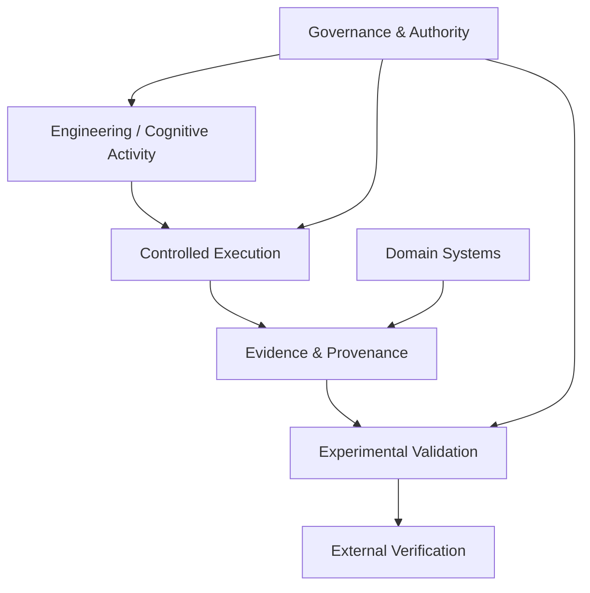
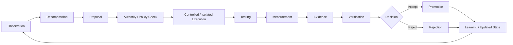
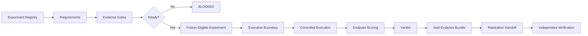
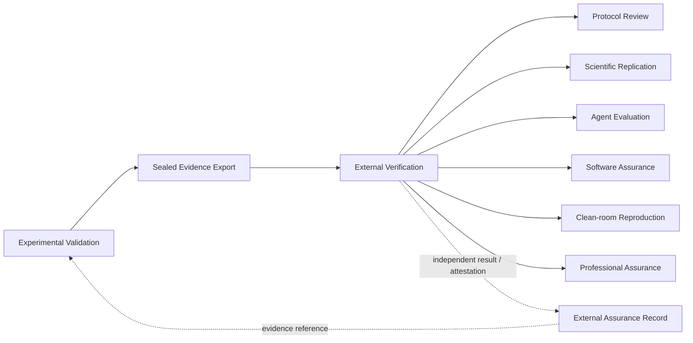
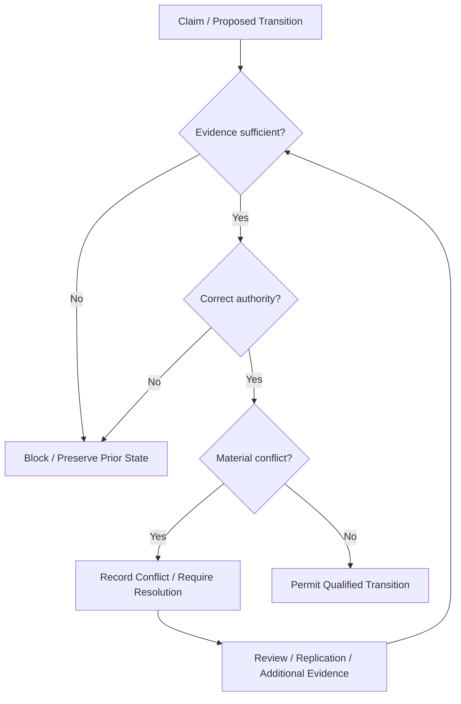

# NEXUS Architecture

## Purpose

NEXUS is an experimental, evidence-governed AI engineering architecture designed to make autonomous engineering behaviour inspectable, measurable, falsifiable and independently reviewable.

The architecture does not treat autonomous capability as sufficient evidence of reliability. Instead, it separates cognition and engineering activity from the mechanisms responsible for evidence, authority, experimental validation, provenance and independent verification.

The architectural objective is to support empirical investigation of the central NEXUS research question:

> Does an evidence-governed, cognitively informed agent architecture produce more reliable, better-calibrated and more transferable autonomous engineering behaviour than appropriate alternative architectures under controlled, preregistered evaluation?

This document describes the public architecture. It does not assert that the central hypothesis has been experimentally confirmed.

---

## Architectural Principles

### Evidence Before Capability Claims

Reported success and demonstrated success are different states. Claims should resolve to inspectable evidence wherever possible.

### Explicit Authority

Observation, proposal, execution, verification, promotion and independent review should have identifiable authority boundaries.

### Governed Execution

Execution-capable components should operate through explicit boundaries rather than receiving unrestricted implicit authority.

### Provenance Preservation

Evidence should retain sufficient provenance to identify origin, transformation and responsible component or authority.

### Falsifiable Experimentation

Experimental hypotheses, endpoints, gates and failure conditions should be defined before outcome interpretation.

### Separation of Validation and Independent Verification

Internal validation and independent verification are architecturally distinct evidence states.

### Negative Evidence Preservation

Blocked, failed, negative and null outcomes should remain part of the evidence record.

---
## Architectural Layers

NEXUS can be understood as several interacting but authority-bounded layers.



The diagram represents logical authority and evidence flow rather than a claim that every subsystem communicates through one physical runtime pipeline.

### Layer 1 — Engineering and Cognitive Activity

Primary engineering activity is represented principally through Engineering Studio and related orchestration components.

Responsibilities include observation, decomposition, proposal generation, engineering work, testing, measurement and production of candidate evidence.

Primary public surface:

`systems/engineering_studio/`

### Layer 2 — Governance and Authority

Governance constrains what components may observe, execute, promote, validate or publish.

Authority controls are distributed across Engineering Studio governance, execution boundaries, federation contracts and external-verification invariants.

The architectural intent is that possession of a capability does not automatically imply authority to exercise it.

### Layer 3 — Controlled Execution

Execution is separated from proposal and observation so that proposed work can be subjected to explicit execution policy, isolation, testing and evidence capture.

Relevant public surfaces include:

- `systems/engineering_studio/canonical_execution_orchestrator/`
- `systems/engineering_studio/experiment_execution_pipeline/`
- `systems/engineering_studio/experimental_validation/execution_boundary.py`

### Layer 4 — Evidence and Provenance

Evidence and provenance infrastructure provides the traceability required to distinguish measured outcomes from unsupported self-report.

Important surfaces include:

- `systems/librarian/`
- `systems/librarian/ACADEMIC_PROVENANCE_STANDARD.md`
- `systems/nexus_federation/docs/PROVENANCE_STANDARD.md`
- `systems/nexus_federation/docs/EVIDENCE_MODEL.md`
- `.nexus_provenance/`

### Layer 5 — Experimental Validation

Experimental Validation determines whether predefined evidence and readiness conditions are satisfied before an experiment can legitimately advance through its governed lifecycle.

Primary surface:

`systems/engineering_studio/experimental_validation/`

Its responsibilities include gate validation, readiness assessment, technical verification, execution-boundary control, result validation, evidence sealing and replication handoff.

### Layer 6 — External Verification

External Verification provides a separately governed assurance surface intended to support protocol review, scientific replication, agent evaluation, software assurance and clean-room reproduction.

Primary surface:

`research/external_verification/`

This layer must not be interpreted as independent merely because it exists in the repository. Independence depends on the verifier, process and evidence satisfying the defined external-verification requirements.

### Layer 7 — Domain Systems

Domain systems provide specialist environments in which NEXUS evidence, governance and coordination mechanisms can operate.

Current public domain surfaces include DAT_AI, Sentinel, News Intelligence and YouTube Production.

These systems provide engineering and evaluation contexts; they do not independently establish the validity of the central NEXUS hypothesis.

---
## Engineering Lifecycle

Engineering Studio is intended to convert autonomous engineering activity into a governed, evidence-producing lifecycle rather than an unrestricted generate-and-execute loop.

Conceptually:



This diagram represents the intended governed lifecycle. Individual historical Engineering Studio versions may implement different subsets or mechanisms and should be evaluated from their actual code and evidence.

### Observation

The system gathers inspectable state about the relevant engineering environment before selecting or proposing work.

Observation should be distinguished from mutation: discovering a condition does not itself authorize a change.

### Decomposition and Proposal

Observed conditions can be decomposed into candidate engineering tasks and proposals.

A proposal represents candidate work, not evidence that the work has occurred.

### Authority and Policy Check

Execution-capable work should cross an explicit authority boundary before mutation.

This layer is intended to constrain what may execute, where it may execute and under which conditions.

### Controlled Execution

Authorized work is executed through bounded execution mechanisms rather than treating generated commands or code as implicitly trusted.

The public architecture includes explicit command-policy and execution-boundary mechanisms.

### Testing and Measurement

Testing determines whether implementation behaviour satisfies relevant technical expectations.

Measurement should derive from real execution, filesystem state, test results or other inspectable observations rather than fabricated or hard-coded success indicators.

### Evidence Production

Execution and measurement produce candidate evidence artifacts that can be inspected independently of the component making the original claim.

### Verification

Verification compares claims with available ground truth, evidence and predefined requirements.

Internal verification remains distinct from independent external verification.

### Promotion or Rejection

Candidate work should advance only when the applicable evidence and governance requirements are satisfied.

Failure to satisfy those requirements should result in rejection, blocking or further remediation rather than silent promotion.

### Learning and Subsequent Cycles

Verified outcomes may inform subsequent observations, task selection, technical-debt records, dependency understanding and future proposals.

Learning should preserve the distinction between historical evidence and newly inferred recommendations.

---
## Experimental Lifecycle

Scientific experiments use a more restrictive lifecycle than ordinary engineering work.

The experimental architecture is intended to prevent implementation activity, internal testing or architectural confidence from being silently promoted into scientific evidence.

Conceptually:



### Experiment Registration

Canonical experiment state is recorded through the research experiment registry rather than inferred from implementation activity.

Primary registry:

`systems/librarian/experiments/registry.json`

### Requirements and Evidence Gates

Experiments define required gates that must be satisfied by appropriate evidence before readiness can be established.

Relevant surfaces include:

- `systems/engineering_studio/experimental_validation/config/experiment_requirements.json`
- `systems/engineering_studio/experimental_validation/gate_records/`
- `systems/engineering_studio/experimental_validation/gate_validator.py`

### Human Attestation

Some requirements cannot legitimately be satisfied by automated technical inference alone.

The architecture therefore includes a human-review queue for gates requiring human attestation or authority.

Primary surface:

`systems/engineering_studio/experimental_validation/human_queue/`

### Readiness Evaluation

Readiness is an evidence-derived state. It should not be granted because implementation appears complete or because a component self-reports readiness.

Relevant surfaces include:

- `systems/engineering_studio/experimental_validation/readiness.py`
- `systems/engineering_studio/experimental_validation/state/readiness.json`
- `systems/engineering_studio/experimental_validation/state/gate_state.json`

### Blocking

If required gates remain unsatisfied, the experiment remains blocked.

At the documented initial public release, all six canonical experiments are recorded as `BLOCKED / PENDING`.

### Freeze and Execution Boundary

An experiment that becomes eligible for execution should preserve the preregistered hypothesis, endpoints and relevant requirements before execution.

Execution then occurs through the governed experimental execution boundary rather than through unrestricted autonomous mutation.

Relevant surface:

`systems/engineering_studio/experimental_validation/execution_boundary.py`

### Endpoint Scoring and Result Validation

Experimental outcomes should be evaluated against predefined endpoints rather than criteria invented after results are observed.

Relevant surface:

`systems/engineering_studio/experimental_validation/result_validator.py`

### Evidence Sealing

Experimental evidence should be bundled and sealed so that the evaluated evidence state can be distinguished from later modifications.

Relevant surface:

`systems/engineering_studio/experimental_validation/bundle_sealer.py`

### Replication Handoff

Eligible evidence can then be transferred into the replication and external-verification process.

Relevant surfaces include:

- `systems/engineering_studio/experimental_validation/replication.py`
- `research/external_verification/01_scientific_replication/`

Replication infrastructure is not equivalent to completed independent replication.

---
## Independent Verification Authority Model

Independent verification is architecturally separated from primary experiment execution and internal validation.

The purpose of this separation is to reduce circular assurance: the component responsible for producing a result should not automatically become the final authority establishing the independence or scientific credibility of that result.

### Separation of Duties

The External Verification architecture defines governance and interface boundaries under:

- `research/external_verification/00_master/governance/SEPARATION_OF_DUTIES.md`
- `research/external_verification/00_master/governance/HARD_INVARIANTS.md`
- `research/external_verification/00_master/governance/EV_INTERFACE_CONTRACT.md`
- `research/external_verification/00_master/governance/EVIDENCE_EXPORT_POLICY.md`

Conceptually:



The dotted return path represents evidence or assurance information, not unrestricted control over the primary experimental system.

### What External Verification May Evaluate

Depending on the applicable protocol, an external verifier may evaluate:

- protocol quality;
- evidence completeness;
- reproducibility;
- experimental results;
- agent behaviour;
- software assurance properties;
- clean-room reproduction;
- conflicts or contradictions in evidence;
- professional assurance requirements.

### What External Verification Must Not Imply

The existence of an External Verification package does not by itself establish:

- verifier independence;
- successful replication;
- experimental validity;
- absence of conflicts of interest;
- publication eligibility;
- correctness of the original claim.

Those states require their own evidence.

### Registries

External Verification maintains explicit registries for assurance-related entities and events.

Public registry surfaces include:

- `research/external_verification/registry/claims/CLAIM_REGISTER.json`
- `research/external_verification/registry/evidence/EVIDENCE_REGISTER.json`
- `research/external_verification/registry/conflicts/CONFLICT_REGISTER.json`
- `research/external_verification/registry/verifiers/VERIFIER_REGISTER.json`
- `research/external_verification/registry/attestations/ATTESTATION_REGISTER.json`
- `research/external_verification/registry/events/EVENT_LEDGER.json`
- `research/external_verification/registry/packages/PACKAGE_REGISTER.json`

### Verification Modes

The public architecture defines multiple assurance modes:

1. protocol review;
2. scientific replication;
3. agent evaluation;
4. software assurance;
5. clean-room reproduction;
6. professional assurance.

These modes provide different forms of evidence and should not be collapsed into one generic PASS state.

### Independent Replication

Independent replication is a stronger claim than internal reproducibility.

For NEXUS to claim independent replication, the relevant verifier, protocol, evidence package, execution environment and result must satisfy the applicable independence and replication requirements.

At the initial public release, independent replication of the central NEXUS hypothesis is **not claimed**.

---
## Component Responsibility and Authority Map

NEXUS separates functional responsibility from evidential and decision authority. The following matrix describes the public architecture at a high level.

| Component | Primary responsibility | Evidence / artifacts | Authority boundary |
|---|---|---|---|
| **Engineering Studio** | Observe, decompose, propose, execute governed engineering work, test and measure | execution results, tests, measurements, engineering evidence | Engineering activity does not itself establish scientific validity |
| **Experimental Validation** | Evaluate experiment requirements, gates, readiness, results and evidence state | gate records, readiness state, technical verification, sealed evidence | Must not promote blocked experiments merely because implementation exists |
| **Librarian / Research** | Research corpus, provenance, source hierarchy, experiment registration and evidence organization | provenance records, corpus records, experiment registry, research workflow | Research storage does not itself validate experimental claims |
| **NEXUS Federation** | Cross-domain delegation, evidence exchange, provenance and executive synthesis | delegation records, provenance graphs, evidence-resolution structures | Coordination does not automatically confer execution or scientific-verdict authority |
| **External Verification** | Independent assurance, replication, protocol review and clean-room evaluation | external claims, attestations, replication records, assurance packages | Must remain distinct from primary experiment execution and internal state authority |
| **DAT_AI** | Geospatial and land-intelligence domain surface | data provenance, model/data evidence, domain outputs | Domain outputs do not validate the central NEXUS hypothesis |
| **Sentinel** | Market-intelligence domain surface | decision, signal, regime, freshness and quality evidence | Domain outputs are not equivalent to financial advice or independent scientific validation |
| **News Intelligence** | Structured news acquisition and intelligence | materiality, failure-test and evidence records | Domain analysis does not confer cross-system scientific authority |
| **YouTube Production** | Governed media-production surface | fact-check, rights, QC and publication evidence | Publication capability does not establish factual correctness without applicable evidence |

### Engineering Studio

Engineering Studio is principally responsible for producing and measuring engineering work.

It may generate candidate evidence, but the fact that Engineering Studio produced an artifact does not automatically make the artifact experimentally valid.

### Experimental Validation

Experimental Validation is responsible for the governed scientific state of registered experiments.

It evaluates requirements and evidence rather than treating architectural completeness as experimental success.

The public experiment registry currently records all six canonical experiments as `BLOCKED / PENDING`.

### Librarian / Research

The Librarian provides research memory, provenance and canonical research-state infrastructure.

Its role is particularly important for maintaining the distinction between a source, an interpretation of that source and a later claim derived from it.

### NEXUS Federation

Federation provides the coordination layer through which institutions or specialist systems can exchange delegations, evidence and state.

Federation therefore has an evidence-routing and synthesis role, but federation-level synthesis should remain traceable to underlying evidence.

### External Verification

External Verification operates as a separately governed assurance surface.

Its strongest scientific value depends on actual independence: repository separation alone cannot establish that a verifier is independent.

### Domain Systems

DAT_AI, Sentinel, News Intelligence and YouTube Production provide specialist operational and experimental contexts.

They can generate domain-specific evidence and exercise broader NEXUS mechanisms without being treated as proof of the central architecture-level hypothesis.

---

## Data, Evidence and Provenance Flow

NEXUS distinguishes data movement from evidence qualification.

An artifact does not become scientific evidence merely because it was produced
by a functioning subsystem. Evidence acquires meaning through provenance,
validation, experiment binding and, where applicable, independent verification.

### Canonical Evidence Flow

```mermaid
flowchart LR
    SRC[Source / Observation]
    ING[Ingestion]
    ART[Artifact]
    PROV[Provenance Record]
    CLAIM[Claim]
    EVID[Evidence Record]
    REG[Experiment Registry]
    GATE[Experimental Validation Gate]
    RUN[Controlled Experiment]
    RESULT[Result]
    SEAL[Sealed Evidence Bundle]
    EXT[External Verification]
    REPL[Independent Replication]
    STATE[Qualified Scientific State]

    SRC --> ING
    ING --> ART
    ART --> PROV

    PROV --> EVID
    CLAIM --> EVID

    EVID --> REG
    REG --> GATE

    GATE -->|PASS| RUN
    GATE -->|BLOCKED| REG

    RUN --> RESULT
    RESULT --> SEAL

    SEAL --> EXT
    EXT --> REPL
    REPL --> STATE
```



The important architectural property is that no single transition in this chain silently grants authority to a later state.

### 1. Source and Observation

The evidence chain begins with an identifiable source, observation, dataset, execution result or other bounded input.

Where applicable, source identity should preserve sufficient information to determine origin, version, time, scope and transformation history.

Unknown provenance is not equivalent to known provenance.

### 2. Ingestion

Ingestion brings information into a NEXUS subsystem.

Successful ingestion establishes that an artifact was acquired or accepted by an interface. It does not establish that the artifact is true, experimentally valid or suitable for supporting a scientific claim.

### 3. Artifact

An artifact may include source material, dataset records, generated reports, measurements, execution traces, test results, model outputs, experiment outputs, review records or provenance metadata.

Artifacts remain distinguishable from claims made about them.

### 4. Provenance

Provenance records establish traceability.

Depending on the subsystem, provenance may identify source, acquisition path, timestamp, transformation, producer, version, hash, dependency, evidence relationship and experiment relationship.

NEXUS uses provenance to make later claims inspectable rather than relying solely on narrative descriptions of how an artifact was produced.

### 5. Claim

A claim is a proposition whose evidential status can be evaluated.

Claims should remain separable from their supporting artifacts so that a verifier can inspect exactly what is claimed, which evidence supports or contradicts it, what transformations occurred and what uncertainty remains.

### 6. Evidence Record

Evidence records connect claims to inspectable artifacts and provenance.

Evidence may support, contradict, qualify or fail to resolve a claim. The existence of an evidence record therefore does not imply that the claim has been confirmed.

Negative, contradictory and null evidence remain part of the evidence state.

### 7. Experiment Registry

The canonical experiment registry binds scientific claims to explicit experimental definitions.

Primary surface:

`systems/librarian/experiments/registry.json`

The registry provides controlled research state for experiment identity, hypotheses, requirements, protocols, evidence artifacts, result status and final verdict.

### 8. Experimental Validation Gates

Experimental Validation evaluates whether prerequisites for governed execution have actually been satisfied.

A gate may depend on technical evidence, provenance, stability requirements, human attestations or other preregistered conditions.

A blocked experiment remains blocked even when substantial implementation work exists elsewhere in the repository.

No missing gate may be silently inferred from unrelated evidence.

### 9. Controlled Execution

Only an eligible experiment should cross from readiness into controlled execution through its governed execution path.

Execution should preserve the frozen experimental definition and applicable authority boundaries.

Execution itself is not the final scientific verdict.

### 10. Result Qualification

Experiment outputs must be evaluated against the preregistered endpoints, thresholds and failure criteria.

A result should not be upgraded merely because implementation or execution completed successfully.

### 11. Evidence Sealing

Where required, the resulting evidence package is sealed so later review can determine what inputs, outputs, analysis and provenance belonged to the evaluated run.

Hashing and immutable references support integrity checking. They establish artifact identity, not scientific truth by themselves.

### 12. External Verification

External Verification receives evidence through a constrained interface.

Its architecture explicitly separates external assessment from Experimental Validation authority.

It does not automatically execute canonical experiments, mutate the canonical experiment registry, transition experiment state, rewrite preregistered endpoints or declare an internal gate satisfied.

### 13. Independent Replication

Independent replication represents a stronger evidence state than internal execution alone.

For replication to support an independence claim, independence must be substantive rather than merely structural.

Repository separation alone is insufficient to establish scientific independence.

### Evidence-State Transitions

An earlier evidence state must not be silently promoted into a later one.

```text
artifact exists
    != evidence valid
    != gate satisfied
    != experiment ready
    != experiment successful
    != scientific claim supported
    != independently replicated
```

Each transition requires its own evidence and applicable authority.

### Negative Evidence

Negative evidence is retained rather than hidden or converted into a successful narrative.

Examples include failed tests, rejected evidence, contradictory findings, failed gates, null outcomes, unsuccessful replication, provenance gaps, contamination, invalid runs and unresolved uncertainty.

### Cross-Domain Evidence

DAT_AI, Sentinel, News Intelligence and YouTube Production can produce domain-specific artifacts, provenance and measured outcomes.

Those artifacts may become inputs to research or engineering evaluation, but domain operation does not automatically establish the central NEXUS scientific hypothesis.

### Evidence Resolution Across Federation

NEXUS Federation provides structures for cross-domain evidence, provenance and contradiction handling.

Federated synthesis should preserve the ability to resolve conclusions back to contributing evidence, including conflicting evidence, source identity, provenance, uncertainty, temporal state and institutional origin.

### Core Epistemic Invariant

> **No claim should acquire a stronger evidential status than the strongest valid evidence and authority transition that actually supports it.**

This principle applies to engineering claims, experimental claims, security claims, operational claims and independent-verification claims.

---
## Failure, Trust and Authority Model

NEXUS treats failure, uncertainty and disagreement as evidence states that must remain visible rather than conditions to be automatically repaired into success.

The architecture therefore distinguishes technical failure, evidential failure, provenance failure, authority failure and scientific disagreement.

### Conservative Failure Principle

When the available evidence cannot justify a stronger state, the system should preserve the weaker state.

Conceptually:



This model intentionally makes unresolved uncertainty capable of stopping progression.

### Gate Failure

If a required experimental gate fails or lacks sufficient evidence, the experiment should remain blocked.

A failed gate must not be converted into readiness because adjacent implementation work appears complete.

The appropriate response is additional evidence, remediation, explicit waiver where legitimately authorized, or continued blocking.

### Execution Failure

Execution failure is an observed result, not permission to fabricate a successful outcome.

Failed commands, exceptions, failed tests, invalid outputs and incomplete execution should remain represented in the resulting evidence state.

Retry may be appropriate when permitted by protocol, but the original failure remains part of the execution history.

### Measurement Failure

If a required quantity cannot be measured reliably, NEXUS should distinguish `unknown` or `unresolved` from zero, success or failure.

Missing measurement must not be replaced with a convenient constant merely to complete an evidence record.

### Provenance Failure

When source provenance is absent, incomplete or contradictory, downstream confidence should be constrained accordingly.

A provenance gap should remain visible until repaired or explicitly accepted under the applicable governance rule.

Unknown provenance must not silently become trusted provenance.

### Evidence Conflict

Conflicting evidence should be represented as conflict rather than resolved through whichever result is most favourable to the current hypothesis.

Where material, conflict resolution may require:

- additional evidence;
- source-quality comparison;
- provenance inspection;
- temporal reconciliation;
- rerunning a measurement;
- protocol review;
- independent replication;
- explicit human adjudication.

### Internal Verification Disagreement

When an internal verifier disagrees with the producing component, the disagreement should block unsupported promotion until the discrepancy is resolved.

The producing component does not receive automatic priority merely because it performed the original work.

### External Verification Disagreement

An external verifier may produce evidence that supports, qualifies, contradicts or fails to reproduce an internal result.

Such evidence should be retained without rewriting the historical internal result.

The architecture should preserve both the original result and the subsequent verification outcome with their respective provenance.

### Replication Failure

Failure to replicate is scientifically meaningful.

A failed replication must not be represented as successful independent replication.

Depending on the protocol, the appropriate state may be unsupported, contradicted, unresolved, qualified or replication-failed.

The original experiment may remain historically valid as an executed experiment while its broader claim loses evidential strength.

### Authority Conflict

When two components disagree about state, the component with the applicable authority for that state should govern the transition.

Examples:

- Engineering Studio may produce engineering evidence but does not thereby determine scientific validity;
- Experimental Validation governs canonical experiment readiness and internal result state;
- External Verification governs its own assurance findings but must not silently rewrite canonical experiment state;
- human-attestation gates require the applicable human authority rather than automated substitution.

### Trust Is Evidence-Qualified

NEXUS should not model trust as a permanent property of a component.

Trust should instead depend on the relevant evidence, provenance, scope, authority and historical performance for the decision being made.

A component may therefore be trusted for one class of observation while lacking authority or sufficient evidence for another.

### Failure Propagation

Material upstream failure should constrain downstream claims that depend on the failed state.

Conceptually:

```text
provenance unresolved
        ↓
evidence qualification constrained
        ↓
required gate unsatisfied
        ↓
experiment remains blocked
        ↓
no experimental success claim
        ↓
no independent-replication claim
```

This prevents a downstream success label from hiding an unresolved upstream dependency.

### Recovery

Recovery should repair the failed prerequisite rather than bypass the evidence requirement.

After remediation, the affected state should be re-evaluated from evidence.

Recovery itself should leave an inspectable record where the applicable subsystem supports one.

### Historical Integrity

Later success should not erase earlier failure.

Historical evidence should preserve enough state to reconstruct what was known, what failed, what changed and why a later decision differed.

### Trust Hierarchy

No universal evidence hierarchy is appropriate for every NEXUS decision, but the architecture follows several general preferences:

1. measured evidence over unsupported self-report;
2. attributable evidence over evidence with unknown provenance;
3. preregistered criteria over post-hoc criteria;
4. reproducible results over irreproducible assertions;
5. independent evidence over circular self-certification where independence is required;
6. explicit uncertainty over fabricated precision;
7. preserved disagreement over unsupported consensus.

### Failure Invariant

> **Failure, uncertainty or disagreement must not be silently transformed into stronger evidence than the underlying record supports.**

This invariant allows NEXUS to fail visibly rather than succeed fictionally.

---
## Architectural Limitations and Interpretation

This document describes the intended and publicly represented NEXUS architecture. It should not be interpreted as evidence that every architectural relationship has been empirically validated.

Important limitations include:

- multiple historical Engineering Studio generations remain represented in the public repository;
- conceptual diagrams describe authority and evidence relationships and do not necessarily represent one literal runtime topology;
- implementation maturity varies between components;
- the presence of a governance mechanism does not establish that every possible execution path is governed by it;
- the presence of provenance infrastructure does not establish complete provenance for every historical artifact;
- the presence of Experimental Validation infrastructure does not mean that the canonical experiments are ready or completed;
- the presence of External Verification infrastructure does not establish verifier independence or successful replication;
- domain-system implementation does not establish the central architecture-level scientific hypothesis;
- security controls reduce defined risks but do not establish universal software security;
- future implementation changes may require this architectural description to be revised.

### Target Architecture Versus Demonstrated State

Readers should distinguish three categories:

| Category | Meaning |
|---|---|
| **Architectural intent** | A documented design principle, authority relationship or target behaviour |
| **Implemented mechanism** | Corresponding code, configuration, schema or governance artifact is present |
| **Demonstrated property** | The relevant property has been established through applicable evidence |

The existence of an implemented mechanism does not automatically establish the corresponding demonstrated property.

### Current Scientific Boundary

At this release point, the six canonical NEXUS experiments remain `BLOCKED / PENDING`.

Accordingly, this architecture should be evaluated as an implemented experimental research architecture whose central hypotheses remain under evaluation.

Independent replication of the central NEXUS hypothesis is not claimed.

---

## Architecture Summary

NEXUS combines governed engineering, evidence and provenance, experimental validation, federation, specialist domain systems and separately governed external verification.

Its defining architectural objective is not merely to produce autonomous behaviour, but to make consequential claims about that behaviour inspectable, challengeable and constrained by evidence and authority.

The architecture therefore attempts to preserve a chain from:

```text
observation
    -> proposal
    -> authorized execution
    -> measurement
    -> evidence
    -> provenance
    -> experimental qualification
    -> result validation
    -> evidence sealing
    -> external verification
    -> independent replication
```

Each transition remains a distinct evidential state.

The scientific value of NEXUS will ultimately depend not on the sophistication of this architecture alone, but on what happens when its preregistered hypotheses are subjected to controlled experiments, appropriate baselines, ablations and independent replication.

**Scientific status:** The central NEXUS scientific hypothesis is **not yet experimentally validated**.
