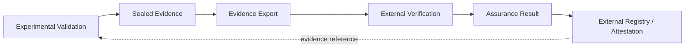

# NEXUS Independent Verification Protocol

## Purpose

This document defines the public assurance boundary between primary NEXUS engineering and experimental activity and subsequent external verification.

Independent verification is treated as a distinct evidence state rather than an extension of internal self-validation.

At this release point, independent replication of the central NEXUS scientific hypothesis is **not claimed**.

### Independence Principle

A verifier is not independent merely because verification code resides in a separate directory or repository surface.

Independence depends on substantive separation of authority, incentives, implementation involvement, experimental control and evidence handling.

### Separation of Duties

Primary execution, internal experimental validation and external assurance should remain distinguishable.

External Verification may assess exported evidence but must not silently acquire authority to:

- execute canonical experiments on behalf of Experimental Validation;
- transition canonical experiment state;
- mutate the canonical experiment registry;
- rewrite preregistered endpoints;
- declare internal readiness gates satisfied.

### Independence Questions

A verifier should disclose:

1. involvement in original implementation;
2. involvement in protocol design;
3. involvement in endpoint selection;
4. access to non-public state;
5. financial or professional conflicts;
6. deviations from the verification protocol;
7. whether the verifier can report contradiction without dependence on the original result.

### Canonical Governance

Relevant governance sources include:

- `research/external_verification/00_master/governance/SEPARATION_OF_DUTIES.md`;
- `research/external_verification/00_master/governance/HARD_INVARIANTS.md`;
- `research/external_verification/00_master/governance/EV_INTERFACE_CONTRACT.md`;
- `research/external_verification/00_master/governance/EVIDENCE_EXPORT_POLICY.md`.

---
## Evidence Handoff

External Verification should consume evidence through a constrained handoff rather than unrestricted access to primary experiment authority.

The return path carries evidence or assurance information, not unrestricted mutation authority.

### Evidence Package

An external package should identify the claim, evidence, provenance, protocol, relevant release identity, deviations and integrity references required by the assurance mode.

### Assurance Modes

The public External Verification architecture contains six distinct assurance surfaces:

1. protocol review;
2. scientific replication;
3. agent evaluation;
4. software assurance;
5. clean-room reproduction;
6. professional assurance.

These modes answer different questions and must not be collapsed into a generic verification PASS.

### Registries

External assurance state is represented through explicit claim, evidence, conflict, verifier, attestation, event and package registries.

Registry existence does not establish that a claim has been independently verified.

---
## Verification Outcomes

External verification should be capable of producing evidence that supports, qualifies, contradicts or fails to resolve the original claim.

### Contradiction

Contradictory evidence must remain visible alongside the original evidence.

The historical original result should not be rewritten merely because a later verifier disagrees with it.

Likewise, the contradictory result must not be suppressed merely because it weakens the preferred hypothesis.

### Replication

Successful internal reproduction and successful independent replication are different evidence states.

Independent replication requires the applicable independence and replication controls.

For `NEXUS-EXP-006`, canonical requirements include valid predecessor completion, sealed evidence, an independent replicator and a clean environment.

Failed or partial replication must not be rounded up to successful replication.

### Attestation

An attestation should identify the verifier, scope, protocol, evidence reviewed, outcome, limitations, conflicts and date where applicable.

An attestation is evidence from a verifier; it is not an absolute guarantee of correctness.

### Conflict Register

Material conflicts between claims, evidence or verification results should remain explicitly represented until resolved or formally classified.

### Failure

Verification failure is itself informative.

Unavailable evidence, broken provenance, irreproducible results, protocol violations and unresolved conflicts should be reported rather than converted into successful assurance.

### Scientific Boundary

The existence of this verification architecture does **not** establish that NEXUS has been independently replicated.

Independent replication of the central scientific hypothesis remains **not claimed** at this release point.

---
