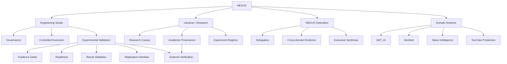

# NEXUS

**An experimental, evidence-governed architecture for investigating reliable autonomous AI engineering.**

NEXUS is a research and engineering architecture for studying whether autonomous AI systems can become more reliable, auditable and scientifically evaluable when their behaviour is constrained by explicit evidence, provenance, governance, memory, experimental validation and independent verification mechanisms.

This repository contains the public research surface of NEXUS.

> **Scientific status:** NEXUS is an experimental architecture. Its six canonical experiments are presently registered as **BLOCKED / PENDING**. This repository therefore does **not** claim that the central research hypotheses have been scientifically validated or independently replicated.

---

## Research Question

The central research programme asks:

> **Does an evidence-governed, cognitively informed agent architecture produce more reliable, better-calibrated and more transferable autonomous engineering behaviour than appropriate alternative architectures under controlled, preregistered evaluation?**

NEXUS is designed to make that question empirically testable rather than answer it by architectural assertion.

The project therefore separates:

- implementation from demonstrated capability;
- internal testing from experimental evidence;
- experimental evidence from independent replication;
- generated claims from provenance;
- execution authority from verification authority;
- architectural intent from measured outcome.

---

## Why NEXUS Exists

Autonomous AI systems can produce convincing outputs while leaving important questions unresolved:

- What evidence supports a claim?
- Was an action actually executed?
- Was a result measured or merely reported?
- Which system or agent had authority to act?
- Can the result be reproduced?
- Was the evaluation specified before the result was known?
- Can another verifier independently challenge the evidence?
- Does performance transfer beyond the environment in which the system was developed?

NEXUS treats these as architectural concerns rather than documentation afterthoughts.

Its research surface combines autonomous engineering mechanisms with explicit experimental, provenance and verification infrastructure.

---

## Architecture

NEXUS is organized as a set of governed research and engineering surfaces rather than a single autonomous agent.



The diagram is a conceptual map of the public research architecture. Detailed authority boundaries, implementation details and evidence are defined within the corresponding subsystem directories.

---
### Engineering Studio

`systems/engineering_studio/`

Engineering Studio provides the governed engineering surface of NEXUS: observation, controlled execution, measurement, evidence generation and experimental-validation machinery.

Important surfaces include:

- `systems/engineering_studio/experimental_validation/`
- `systems/engineering_studio/canonical_execution_orchestrator/`
- `systems/engineering_studio/experiment_execution_pipeline/`
- `systems/engineering_studio/research_evidence/`
- `systems/engineering_studio/studio_v3/`
- `systems/engineering_studio/studio_v4/`

### Experimental Validation

`systems/engineering_studio/experimental_validation/`

Experimental Validation provides explicit machinery for:

- experiment requirements and gate records;
- readiness evaluation;
- technical verification;
- execution boundaries;
- result validation;
- evidence-bundle sealing;
- replication interfaces;
- publication staging;
- human-review queues.

The subsystem currently contains gate records, readiness state, execution-boundary state, technical-verification machinery, replication support and dedicated tests.

Its existence does **not** mean that the canonical NEXUS experiments have succeeded. Experimental infrastructure and experimental results are deliberately treated as separate evidence states.

---
### Librarian / Research Infrastructure

`systems/librarian/`

The Librarian provides the research, evidence-management and academic-provenance layer of NEXUS.

Its public surface includes:

- academic provenance standards;
- corpus architecture and quality governance;
- source hierarchy;
- literature-ingestion protocols;
- citation validation;
- retrieval benchmarking;
- scientific research workflow;
- canonical experiment registration.

Important starting points include:

- `systems/librarian/ACADEMIC_PROVENANCE_STANDARD.md`
- `systems/librarian/CORPUS_ARCHITECTURE.md`
- `systems/librarian/CORPUS_QUALITY_STANDARD.md`
- `systems/librarian/SOURCE_HIERARCHY.md`
- `systems/librarian/experiments/RESEARCH_WORKFLOW.md`
- `systems/librarian/experiments/registry.json`

### External Verification

`research/external_verification/`

External Verification is deliberately separated from the primary experimental machinery so that execution authority and verification authority do not silently collapse into the same role.

The public verification architecture includes:

- separation-of-duties rules;
- hard verification invariants;
- evidence-export policy;
- claim, evidence, conflict and verifier registries;
- external-reviewer attestation;
- protocol review;
- scientific replication;
- agent evaluation;
- software assurance;
- clean-room reproduction;
- professional assurance.

Important starting points include:

- `research/external_verification/00_master/governance/SEPARATION_OF_DUTIES.md`
- `research/external_verification/00_master/governance/HARD_INVARIANTS.md`
- `research/external_verification/00_master/governance/EV_INTERFACE_CONTRACT.md`
- `research/external_verification/00_master/governance/EVIDENCE_EXPORT_POLICY.md`
- `research/external_verification/01_scientific_replication/templates/REPLICATION.md`
- `research/external_verification/04_cleanroom_reproduction/templates/CLEANROOM.md`

The existence of this infrastructure does **not** constitute independent replication. Independent verification is treated as a separate evidence state that requires evidence from an appropriately independent verifier.

---
### NEXUS Federation

`systems/nexus_federation/`

NEXUS Federation provides cross-domain coordination and evidence-aware institutional interaction.

Its documented surfaces include:

- delegation and institutional messaging;
- capability evidence;
- dependency graphs;
- provenance graphs;
- contradiction handling;
- evidence-resolution ledgers;
- executive state and synthesis;
- resource budgeting;
- failure propagation and recovery;
- reproducibility protocols.

Detailed specifications are available under `systems/nexus_federation/docs/`.

### Domain Systems

NEXUS also contains specialist domain systems through which broader evidence, provenance, delegation and governance mechanisms can be exercised.

#### DAT_AI

`systems/dat_ai/`

DAT_AI provides a geospatial and land-intelligence research surface with explicit data-source, evidence, spatial-provenance, storage and operational standards.

#### Sentinel

`systems/sentinel/`

Sentinel provides a market-intelligence research surface containing decision, signal, regime, data-quality, freshness and institutional-contract mechanisms.

#### News Intelligence

`systems/news_intelligence/`

News Intelligence provides structured acquisition and analysis machinery with materiality models, negative controls, failure testing and evidence reporting.

#### YouTube Production

`systems/youtube_production/`

YouTube Production provides a governed media-production surface with fact-checking, rights management, evidence packs, quality control and publication-boundary mechanisms.

These domain systems are useful implementation and evaluation surfaces. Their presence does **not** imply that their outputs, or NEXUS as a whole, have been independently scientifically validated.

---
## Evidence Status

NEXUS uses deliberately conservative evidence terminology. Architectural presence, internal testing, experimental validation and independent replication are separate states.

| Evidence level | Meaning |
|---|---|
| **Implemented** | Relevant code, schemas or architecture are present. |
| **Tested** | Relevant internal tests or technical verification exist. |
| **Evidence recorded** | Structured evidence artifacts have been recorded. |
| **Experimentally ready** | All predefined gates required for experimental execution have been satisfied. |
| **Experimentally validated** | A preregistered experiment has executed and satisfied its predefined endpoints. |
| **Independently replicated** | A sufficiently independent verifier has reproduced the relevant result. |

These terms are intentionally **not interchangeable**.

### Current High-Level Status

| Research surface | Current defensible status |
|---|---|
| Public NEXUS architecture | **Implemented / published** |
| Engineering Studio | **Implemented; internal tests and evidence present** |
| Experimental Validation framework | **Implemented; tests, gates and evidence machinery present** |
| Librarian / research infrastructure | **Implemented; internal validation and provenance material present** |
| NEXUS Federation | **Implemented; specifications, tests and evidence material present** |
| External Verification architecture | **Implemented as independent-verification infrastructure** |
| Canonical experiments | **BLOCKED / PENDING** |
| Central NEXUS scientific hypothesis | **Not yet experimentally validated** |
| Independent replication of central hypothesis | **Not claimed** |

## Canonical Experiments

The canonical experiment registry is:

`systems/librarian/experiments/registry.json`

At this release point it records six experiments:

```text
NEXUS-EXP-001    BLOCKED    PENDING
NEXUS-EXP-002    BLOCKED    PENDING
NEXUS-EXP-003    BLOCKED    PENDING
NEXUS-EXP-004    BLOCKED    PENDING
NEXUS-EXP-005    BLOCKED    PENDING
NEXUS-EXP-006    BLOCKED    PENDING
```

NEXUS intentionally prevents a blocked experiment from being represented as a successful scientific result.

The repository contains substantial preregistration, falsifiability, experimental-gating and replication infrastructure. Those mechanisms establish a framework for obtaining evidence; they are not substitutes for the resulting evidence.

### Claim Discipline

A NEXUS claim should therefore be interpreted according to the strongest evidence state actually reached:

```text
architecture present
        ↓
implementation present
        ↓
internal testing
        ↓
evidence-qualified readiness
        ↓
preregistered experiment
        ↓
endpoint evaluation
        ↓
sealed experimental evidence
        ↓
independent replication
```

A later state must not be inferred solely from evidence of an earlier state.

---
## Evidence-First Design Principles

NEXUS is built around the premise that autonomous capability claims should be constrained by inspectable evidence and explicit authority boundaries.

### 1. Claims Should Be Evidence-Qualified

A component reporting success is not sufficient evidence that success occurred.

Where possible, claims should resolve to independently inspectable artifacts such as:

- subprocess and execution results;
- filesystem observations;
- test results;
- manifests and hashes;
- provenance records;
- gate records;
- evidence bundles;
- external attestations.

### 2. Measurement Should Be Distinguished From Self-Report

NEXUS attempts to distinguish measured outcomes from internally generated descriptions of outcomes. The objective is to reduce the possibility that plausible reporting is mistaken for demonstrated execution.

### 3. Authority Should Be Explicit

Observation, proposal, execution, validation, promotion and independent verification should not silently collapse into a single authority.

Authority boundaries are therefore treated as part of the architecture and evidence model.

### 4. Experiments Should Be Falsifiable

Experimental claims should be evaluated against criteria defined before outcome interpretation.

Where applicable, an experiment should specify:

- hypothesis;
- required gates;
- baseline or comparator;
- predefined endpoints;
- failure conditions;
- relevant ablations;
- evidence requirements;
- replication requirements.

An architecture should be capable of producing evidence against its own hypotheses.

### 5. Provenance Should Travel With Evidence

Important claims should retain sufficient provenance to determine where evidence originated, how it was transformed and which component or authority produced it.

### 6. Reproduction Matters

A result that cannot be reconstructed, inspected or challenged has limited scientific value.

NEXUS therefore includes explicit reproduction, replication and clean-room verification surfaces rather than treating reproducibility as a publication-only concern.

### 7. Negative Results Remain Results

A failed or blocked experiment should remain visible as such rather than being converted into a successful architectural narrative.

### 8. Independent Verification Is a Separate Evidence State

Internal validation and external verification answer different questions. NEXUS therefore models independent verification separately from the machinery responsible for primary execution and experimental state.

---
## Security and Publication Boundary

This repository is a deliberately prepared public research surface. It is not a direct publication of the private operational NEXUS installation.

The initial public release underwent a controlled publication-security and release-hygiene process covering:

- private owner-path detection;
- high-confidence secret scanning;
- generated runtime-artifact removal;
- nested Git detection;
- oversized-file detection;
- executable `shell=True` review and remediation;
- production `eval()` / `exec()` review;
- generic unsafe-deserialization review;
- PyTorch checkpoint-deserialization hardening;
- execution-authority review;
- release-manifest integrity;
- local-to-remote commit identity verification.

For the published release, the defined publication gate reached zero blocking findings for the checked private-path, high-confidence-secret, runtime-artifact, nested-Git, oversized-file, executable-shell, production-eval/exec, generic-deserialization and unsafe-PyTorch-load categories.

This security review establishes only that the **defined publication checks passed for this release candidate**.

It does **not** establish that NEXUS is unhackable, free from every vulnerability, suitable for unrestricted deployment or immune to future security findings.

Security claims should therefore be interpreted as bounded engineering evidence rather than absolute guarantees.

## Release Integrity

The initial public release was published as a clean single-root Git history after publication sanitization and security hardening.

Authorized release identity:

```text
Commit:  2b3f129c21bdf5ef78cfcb59721b09281c8cc489
Tree:    35a6919259d3f0317bd761e0a1a797254b285103
Files:   905 tracked files
History: 1 root commit / 1 visible commit
```

The local authorized commit and the published GitHub `main` commit were verified to match exactly at publication time.

Release provenance is stored under:

`.nexus_provenance/`

including:

- `PUBLIC_FILE_INVENTORY.txt`
- `PUBLIC_SHA256SUMS.txt`
- `EXCLUSION_POLICY.txt`
- `PUBLICATION_STATUS.txt`
- `PREDECESSOR.txt`

The SHA-256 manifest provides an integrity record for the files represented by the sealed release manifest.

Future commits necessarily create new release identities and should not be represented as the original sealed tree above.

---
## Repository Guide

The repository contains multiple research, engineering and evidence surfaces. The following routes provide useful starting points for different audiences.

### For Researchers

Start with:

1. this README;
2. `systems/librarian/experiments/registry.json`;
3. `systems/librarian/experiments/RESEARCH_WORKFLOW.md`;
4. `systems/engineering_studio/experimental_validation/`;
5. `research/external_verification/`.

This route exposes the experiment registry, research workflow, experimental gates and independent-verification architecture before deeper implementation details.

### For AI / Agent Engineers

Start with:

1. `systems/engineering_studio/`;
2. `systems/engineering_studio/canonical_execution_orchestrator/`;
3. `systems/engineering_studio/experiment_execution_pipeline/`;
4. `systems/nexus_federation/`;
5. `systems/librarian/`.

This route emphasizes execution, orchestration, evidence, delegation, governance and research infrastructure.

### For Independent Reviewers

Start with:

1. `.nexus_provenance/`;
2. `research/external_verification/00_master/governance/`;
3. `research/external_verification/registry/`;
4. `systems/engineering_studio/experimental_validation/gate_records/`;
5. `systems/librarian/experiments/registry.json`.

This route emphasizes release integrity, authority separation, evidence records and experiment state.

### For Recruiters / Engineering Review

Useful implementation surfaces include:

- `systems/engineering_studio/` — autonomous engineering and validation;
- `systems/nexus_federation/` — cross-domain coordination and evidence;
- `systems/librarian/` — research, memory and provenance infrastructure;
- `systems/dat_ai/` — domain intelligence architecture;
- `systems/sentinel/` — decision and market-intelligence architecture.

Implementation should be assessed separately from the pending scientific hypotheses.

---
## Limitations

This release should **not** currently be interpreted as evidence that:

- NEXUS outperforms alternative agent architectures;
- the central research hypothesis has been confirmed;
- the six canonical experiments have completed successfully;
- independent replication has occurred;
- every subsystem is production-ready;
- every historical implementation claim has been externally verified;
- all possible security vulnerabilities have been eliminated;
- domain-system outputs constitute financial, scientific, legal or professional advice.

Additional limitations include:

- some tests depend on environmental resources or credentials that may not be available to external users;
- subsystem-specific dependencies and execution procedures are not yet consolidated into one root reproduction workflow;
- implementation maturity varies across subsystems;
- internal evidence does not automatically satisfy independent-verification requirements;
- future commits will differ from the cryptographically identified initial public release.

These limitations are part of the research record rather than exceptions to it.

---
## Current Research Phase

The immediate NEXUS research programme is:

```text
public architecture
        ↓
experimental gate closure
        ↓
preregistered execution
        ↓
endpoint scoring
        ↓
evidence sealing
        ↓
independent replication
        ↓
comparative analysis
        ↓
publication / external review
```

The architecture is therefore best understood as an **experimental research system under evaluation**, not a finished scientific conclusion.

### Immediate Priorities

1. resolve remaining experimental readiness gates;
2. preserve preregistered hypotheses and endpoints;
3. execute eligible experiments through the governed execution boundary;
4. score outcomes against predefined criteria;
5. seal complete evidence bundles;
6. submit eligible results to independent replication;
7. compare NEXUS against appropriate baselines and ablations;
8. report positive, negative and null results;
9. prepare publication only from evidence that survives the required assurance level.

## Project Status

**Public architecture:** available

**Publication-security gate:** passed for the initial public release

**Canonical experiments:** BLOCKED / PENDING

**Central scientific hypothesis:** not yet experimentally validated

**Independent replication:** not yet claimed

---

## NEXUSCogOS

Public research release of the NEXUS experimental AI engineering architecture.
