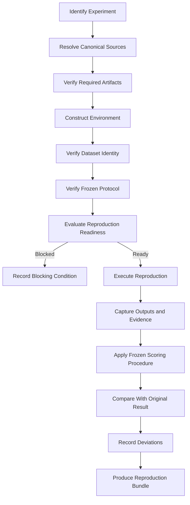

# NEXUS Reproducibility Protocol

## Purpose

This document defines the public reproducibility framework for NEXUS.

Its purpose is to enable another researcher, engineer or reviewer to determine what would be required to reconstruct, inspect and challenge NEXUS experimental evidence without relying solely on claims made by the originating system.

This document does not claim that the canonical NEXUS experiments have already been reproduced or independently replicated.

At this release point:

- canonical experiments: **BLOCKED / PENDING**;
- central scientific hypothesis: **not yet experimentally validated**;
- independent replication: **not claimed**.

---

## Reproducibility Principles

### 1. Reconstructability

A reported result should retain sufficient information for an appropriately equipped reviewer to reconstruct the relevant experimental conditions.

### 2. Artifact Identity

Inputs, datasets, code and evidence artifacts should be identifiable by stable references, versions or cryptographic hashes where applicable.

### 3. Provenance

A reviewer should be able to determine where material evidence originated and which transformations occurred before it was used.

### 4. Frozen Experimental Definition

Hypotheses, protocols, analysis code, thresholds and stopping rules should be frozen where required before governed execution.

### 5. Environment Disclosure

Relevant software, dependencies, configuration and execution-environment conditions should be disclosed sufficiently to identify material differences between runs.

### 6. Evidence Preservation

Positive, negative, null, failed and invalid outcomes should remain available to the applicable evidence process rather than only successful results being retained.

### 7. Deviation Disclosure

Material deviations from the preregistered protocol or original environment should be recorded rather than silently incorporated into a reproduction attempt.

### 8. Reproduction and Replication Are Distinct

Reproduction concerns reconstruction of a result under sufficiently equivalent conditions.

Independent replication additionally requires an appropriately independent verifier or replicator and the applicable replication controls.

An internal rerun is therefore not automatically evidence of independent replication.

---

## Canonical Sources

The reproducibility process should begin from canonical machine-readable and governance sources rather than from this explanatory document alone.

Primary sources include:

- `systems/librarian/experiments/registry.json` — canonical experiment state;
- `systems/librarian/experiments/RESEARCH_WORKFLOW.md` — canonical research workflow;
- `systems/engineering_studio/experimental_validation/config/experiment_requirements.json` — readiness requirements;
- `systems/engineering_studio/experimental_validation/` — experimental-validation implementation;
- `research/external_verification/` — independent-verification and replication architecture;
- `.nexus_provenance/` — public-release provenance and integrity material.

If this document conflicts with a canonical experiment-state source, the canonical source governs.

---
## Reproduction Workflow

A reproduction attempt should proceed through explicit stages so that environment reconstruction, experimental execution and interpretation remain distinguishable.



### Stage 1 — Identify the Canonical Experiment

Begin with the canonical experiment identifier rather than a descriptive project name or historical implementation label.

Resolve the experiment from:

`systems/librarian/experiments/registry.json`

Record the canonical status and verdict before attempting reproduction.

If the experiment remains `BLOCKED`, that state must not be rewritten merely because a reviewer can execute some associated code.

### Stage 2 — Resolve the Experimental Definition

Identify the applicable hypothesis, prediction, comparator, variables, controls, datasets, endpoints, acceptance criteria, rejection criteria and other canonical metadata actually present for the experiment.

Do not reconstruct missing experimental criteria from intuition after inspecting results.

### Stage 3 — Resolve Readiness Requirements

Load the corresponding requirements from:

`systems/engineering_studio/experimental_validation/config/experiment_requirements.json`

Separate global gates from experiment-specific gates.

Record any requirement that cannot be independently established in the reproduction environment.

### Stage 4 — Verify Artifact Identity

Identify the exact code, datasets, configuration, protocol, analysis and evidence artifacts required for the reproduction.

Where hashes or immutable identifiers are available, verify them before execution.

A missing or mismatched artifact should be recorded as a reproduction deviation or blocker rather than silently replaced.

### Stage 5 — Construct the Environment

Create an environment sufficiently isolated and documented to determine which dependencies materially influence the result.

Record, where relevant:

- operating system and architecture;
- interpreter and runtime versions;
- package and dependency versions;
- hardware characteristics;
- environment variables required by the experiment;
- external services;
- credentials or unavailable private dependencies;
- network requirements;
- storage assumptions;
- locale and time assumptions;
- random seeds or determinism controls.

The reproduction environment need not be identical in every irrelevant detail, but material differences must be disclosed.

### Stage 6 — Verify Dataset Identity and Provenance

Before execution, verify that the intended dataset or snapshot is the one defined for the experiment.

Where applicable, record:

- dataset identifier;
- source;
- version or snapshot;
- content hash;
- licence;
- transformation history;
- exclusions;
- contamination controls.

Substituting a different dataset creates a different evidential condition and must be disclosed.

### Stage 7 — Verify the Frozen Protocol

Confirm that the protocol, analysis code, thresholds and stopping rules used for reproduction correspond to the applicable frozen experimental definition.

Changes required for compatibility should be documented before result interpretation.

### Stage 8 — Determine Reproduction Readiness

Before running the experiment, classify unresolved prerequisites.

A useful reproduction-readiness record should distinguish:

```text
VERIFIED
UNAVAILABLE
MISMATCHED
NOT_APPLICABLE
REQUIRES_HUMAN_ATTESTATION
UNRESOLVED
```

The reproduction should not be represented as equivalent to the canonical experiment when material prerequisites remain unresolved.

### Stage 9 — Execute Without Post-Hoc Criteria Changes

Run the applicable procedure without changing success thresholds, endpoints or stopping rules in response to observed outcomes.

Record execution failures, retries and interventions.

If a retry is permitted, preserve the failed attempt in the reproduction history.

### Stage 10 — Capture Evidence

Capture sufficient evidence to determine what actually executed and what result was produced.

Depending on the experiment, this may include:

- command and process results;
- test output;
- logs;
- measurements;
- generated artifacts;
- hashes;
- timestamps;
- resource measurements;
- scoring outputs;
- failure records.

### Stage 11 — Apply the Frozen Scoring Procedure

Score the reproduction using the applicable preregistered analysis and thresholds.

Do not replace a predefined endpoint with a more favourable metric after observing the result.

### Stage 12 — Compare With the Original Evidence

Compare the reproduced result with the original result at the level required by the protocol.

The comparison should distinguish exact reproduction, materially equivalent reproduction, partial reproduction, contradiction, inconclusive reproduction and invalid reproduction where the applicable protocol supports those distinctions.

### Stage 13 — Record Deviations

Every material deviation should be explicit.

Examples include:

- different dependency version;
- unavailable dataset snapshot;
- hardware substitution;
- changed external API;
- altered randomization;
- manual intervention;
- modified analysis code;
- unavailable credential;
- changed protocol condition.

Deviation disclosure allows later reviewers to distinguish failure of the hypothesis from failure to reproduce the original conditions.

### Stage 14 — Produce a Reproduction Bundle

A completed reproduction attempt should produce an inspectable evidence bundle containing the information required to evaluate the attempt.

At minimum, the bundle should identify:

- experiment ID;
- source release or commit;
- reproduction environment;
- input and dataset identities;
- protocol identity;
- deviations;
- execution evidence;
- scoring evidence;
- reproduction outcome;
- reviewer or operator identity where appropriate;
- timestamps;
- integrity references.

Producing such a bundle establishes an inspectable reproduction record. It does not by itself establish independent replication.

---

### Clean Environment Requirement

Independent replication requires an environment sufficiently clean to prevent hidden state from the originating execution environment from silently influencing the result.

For `NEXUS-EXP-006`, the canonical readiness requirements explicitly include:

`NEXUS-EXP-006-04` — **clean environment available**

A clean environment should, where applicable, minimize or explicitly account for:

- undeclared local files;
- cached experiment outputs;
- mutable development state;
- hidden environment variables;
- undeclared credentials;
- unrecorded dependency modifications;
- prior generated artifacts;
- local database state;
- implementation residue from the original experiment;
- undocumented manual configuration.

Clean does not necessarily mean an empty machine. It means that material state capable of influencing the result is either reconstructed from the declared reproduction specification or explicitly identified and justified.

Where the required clean environment cannot be established, the reproduction attempt should record that limitation and must not be represented as satisfying the canonical EXP-006 clean-environment gate.
